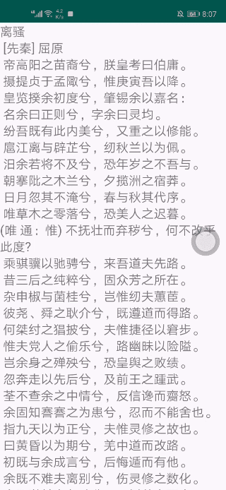
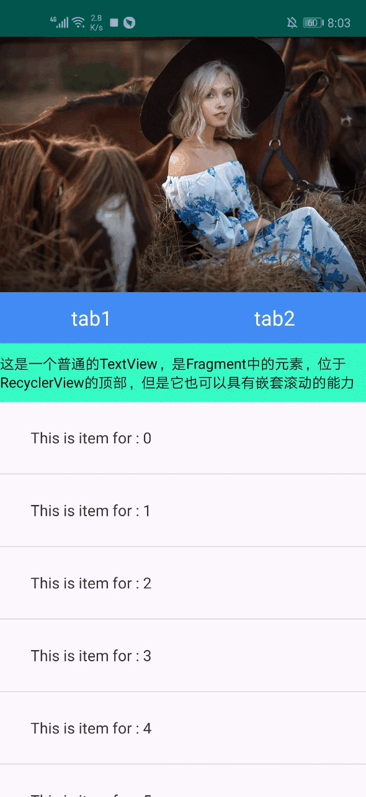
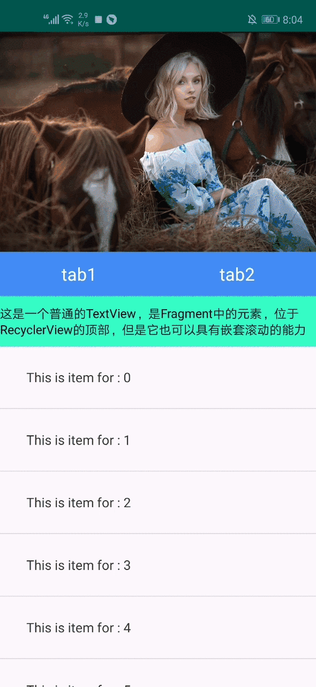

# studyPro
**记录下我学习过程中实现的Demo以及相应的博客，每一块知识点都会以一个Demo以及博客组成一个新的章节。**
## 1、  ScrollerTextView
普通的TextView是不具备滑动功能的，当文字的长度超出了TextView的宽高范围后就会被截断，所以我通过Scroller与View的scrollTo、scrollBy方法结合实现了一个可以跟随手指移动，并且带有fling效果的TextView。

博客地址： https://blog.csdn.net/haoxl1994/article/details/103429055

## 2、 NestedScrollLayout
或者叫做 StickyTabLayout ， 可以配合 RecyclerView、ViewPager、NestedScrollView、以及普通控件完成顶部吸附效果，整个布局均实现了触摸时跟随手指scroll 和 fling

项目代码移步至：https://github.com/haoxinlei1994/NestedScrollLayout

效果图如下：

&nbsp;&nbsp;&nbsp;&nbsp;&nbsp;&nbsp;&nbsp;&nbsp;&nbsp;&nbsp;&nbsp;&nbsp;&nbsp;&nbsp;&nbsp;
